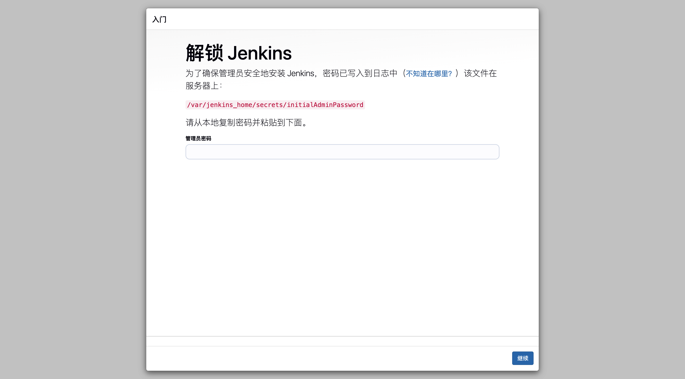
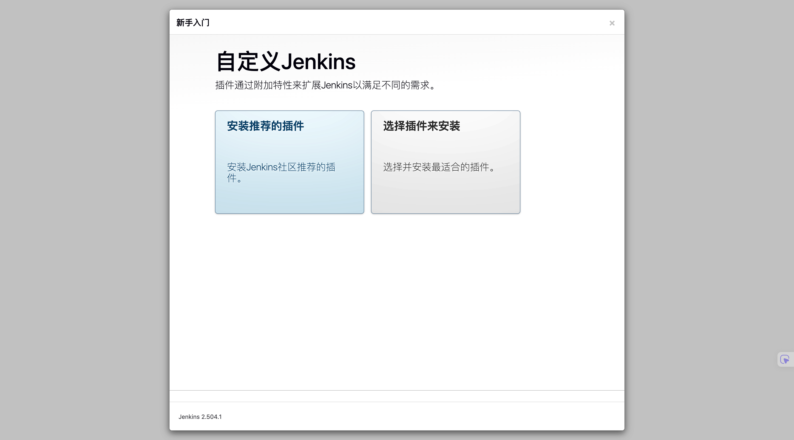
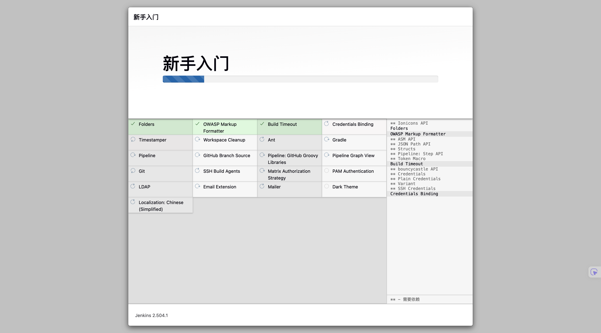
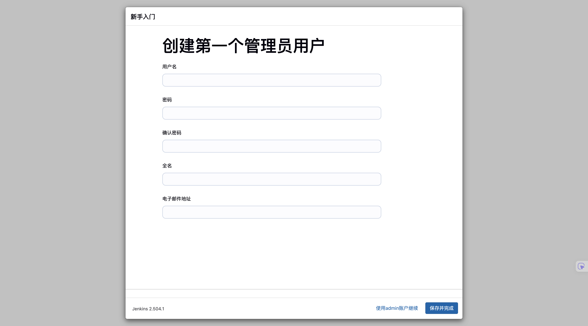
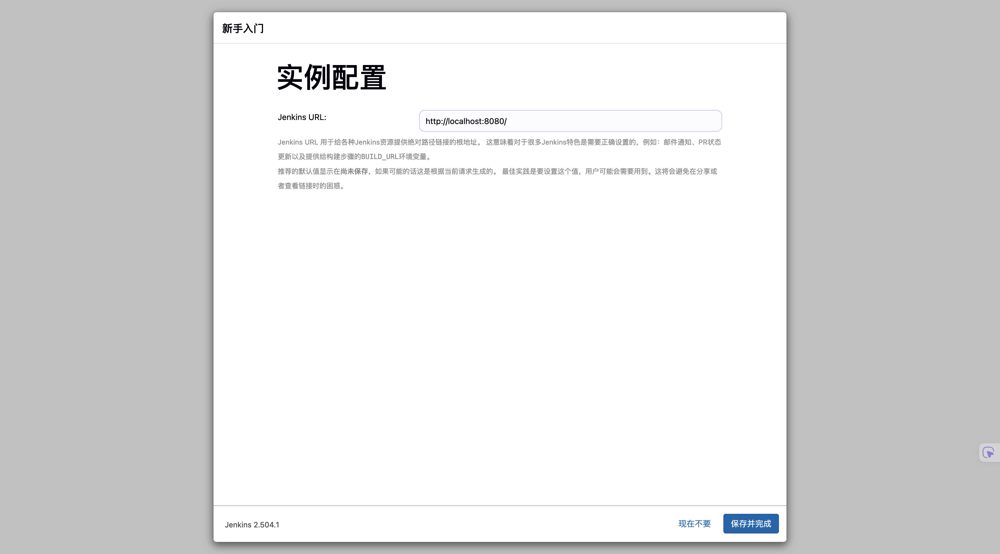
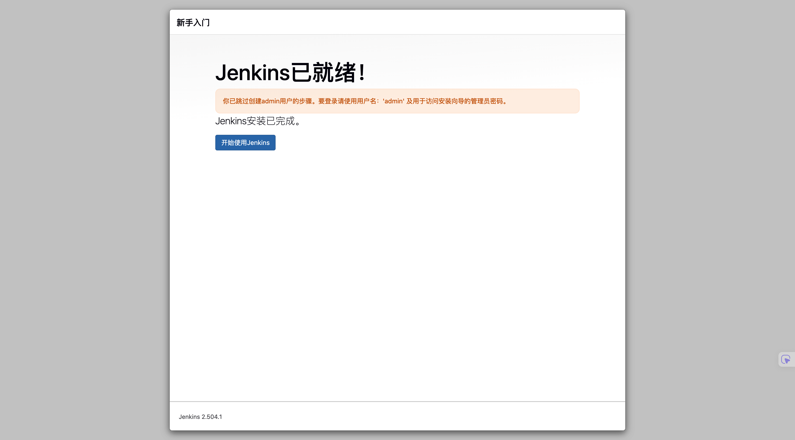
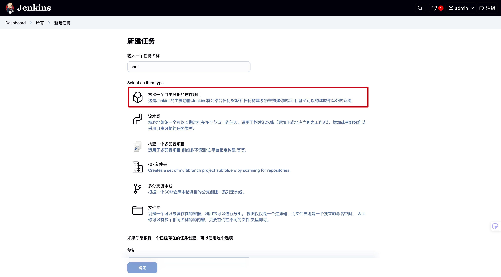
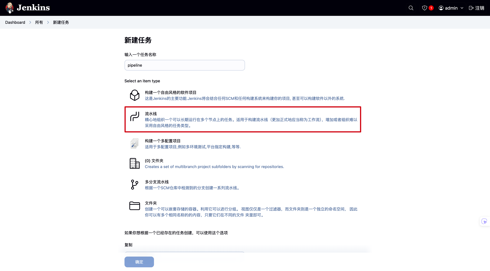

# Polyde

[nginx](./src/nginx/README.md) | [jenkins](./src/jenkins/README.md)

## 1.启动

安装 `docker` 之后：

```bash
docker-compose -f docker-compose.yml up
```

启动成功后，

`nginx` 监听 `80` 端口，访问 [http://localhost](http://localhost)。

`jenkins` 监听 `8080` 端口，访问 [http://localhost:8080](http://localhost:8080)。

## 2.Jenkins UI

在第一步中启动 `jenkins` 后，访问 [http://localhost:8080](http://localhost:8080)，会提示输入管理员密码。



在 `docker-compose.yml` 中，`jenkins` 的管理员密码存放在 `/var/jenkins_home/secrets/initialAdminPassword` 中。

输入密码后，提示安装插件，选择 `Install suggested plugins`。



安装进程如下：



安装完成后，会提示创建用户。当然也可以使用默认的 `admin` 用户（该用户的密码存储地，上文已经提过了）。



创建用户后，提示配置 `Jenkins` URL，默认是 `http://localhost:8080/`，可以直接点击 `Save and Finish`。



最后，我们就可以登录 `Jenkins UI` 了。



:::tip
**如果在安装插件的过程中，有安装失败的插件，那么我们可以在 `Jenkins UI` 中，手动搜索安装对应插件**。
:::

## 3.Jenkins Plugins

安装 `Jenkins` 时，推荐安装的插件外，我们还需要安装以下插件：

### 3-1.NVM Wrapper

[NVM Wrapper](https://plugins.jenkins.io/nvm-wrapper/)

### 3-2.Git Parameter

[Git Parameter](https://plugins.jenkins.io/git-parameter/)

### ~~3-3.Publish Over SSH~~

[Publish Over SSH](https://plugins.jenkins.io/publish-over-ssh/)是基于 `SSH` 协议的插件，可以在 Jenkins 中发布文件到远程服务器。

## 4.Jenkins Environment

### 4-1.NodeJs

1. 在**全局工具配置**中，添加某版本的 `NodeJs`，：

2. 在 `Configure` 的 `Environment` 中，勾选 `Provide Node & npm bin/ folder to PATH`，并选择 `NodeJS` 版本。

## 5.Jenkins Build & Deploy

此节介绍 Jenkins 的 `Shell` 和 `Pipeline` 构建方式。

**此节的 `Shell` 和 `Pipeline` 脚本可在[src/template](./src/template/)目录下寻找**。

### 5-1.Shell



如果使用 `Shell` 方式（**自由风格**）的话，分为两步：

1. 在创建过程中，自助勾选要应用的插件，并填写相关信息，譬如 `NVM Wrapper`、 `Git Parameter`。
2. 在 `Build Steps` 中，填写 `Shell` 脚本。

### 5-2.Pipeline



如果使用 `Pipeline` 方式（**流水线**）的话，只有一步：

1. 填写  `Pipeline` 脚本。
